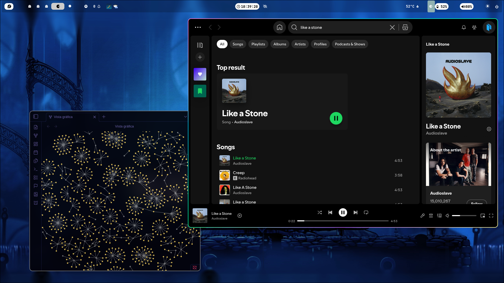
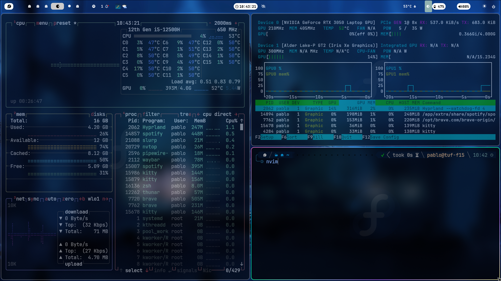
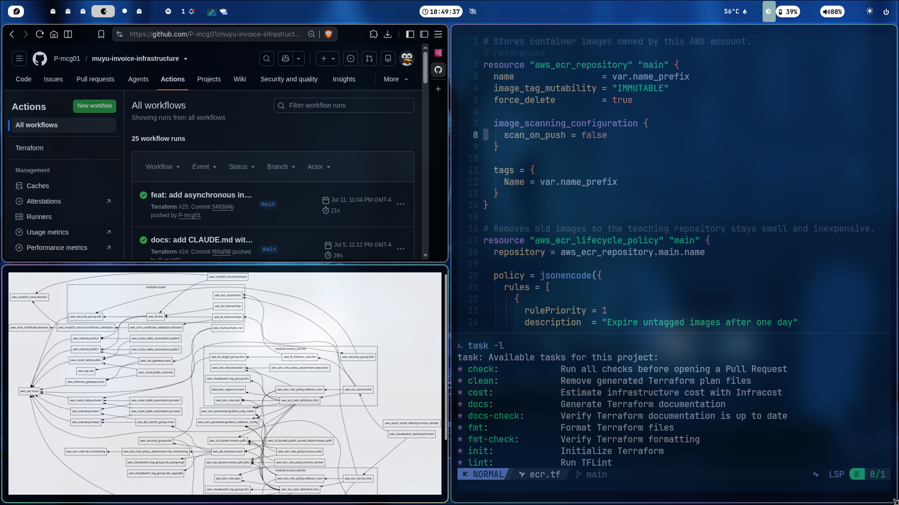

# Personal Dotfiles

A modern Linux desktop focused on productivity, simplicity, and a keyboard-first workflow.

Built on Fedora Linux with Hyprland, Kitty, and Zsh.


## Overview

This repository contains my personal Linux configuration files managed with **chezmoi**.

For a detailed history of changes, see the [CHANGELOG.md](./CHANGELOG.md).

## Showcase





### Core Components

- **OS:** Fedora 44
- **Compositor:** Hyprland
- **Terminal:** Kitty
- **Shell:** Zsh
- **Dotfile Manager:** Chezmoi

## Installation

Clone and initialize the dotfiles with chezmoi:

```bash
chezmoi init git@github.com:P-mcg01/dotfiles.git
chezmoi apply
```
